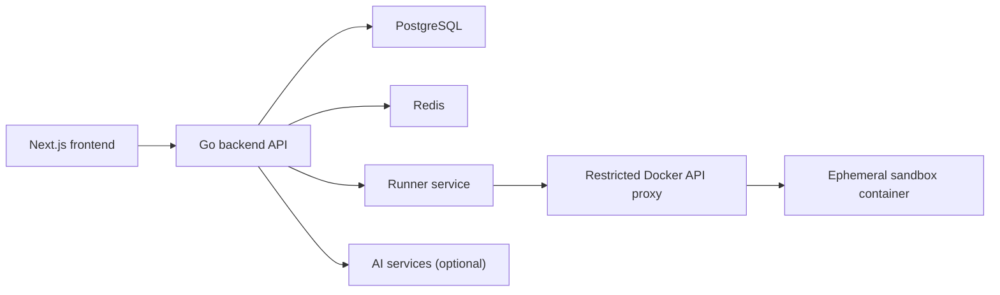
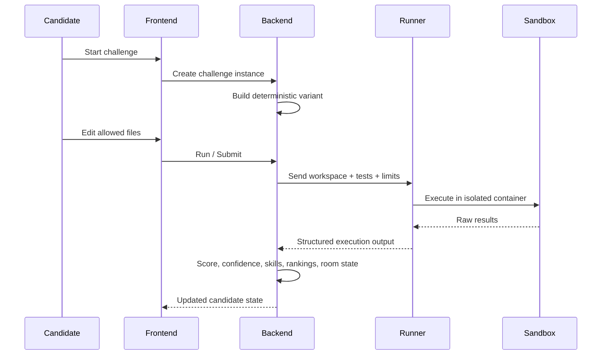

# Square and Fair

Square and Fair is a skill evaluation platform for developers and recruiters.

It combines real code execution, deterministic challenge variants, explainable scoring, and a visual room that reflects actual skill signals. The product is designed to answer a simple question well:

**Can we evaluate technical ability in a way that feels fair to candidates and useful to recruiters?**

## TL;DR

- skill-based hiring platform with real code execution
- anti-cheat evaluation system
- scalable backend built on Go, PostgreSQL, Redis, and isolated Docker execution
- designed for production, not demo

The name is intentional:
- **Fair**: scores come from real execution, not quizzes or keyword filters
- **Square**: the room metaphor gives the product a concrete visual space instead of a generic dashboard

## What the product does

For developers:
- solve real coding challenges
- get score, confidence, explanations, and a living skill room
- keep progression visual without turning the system into pay-to-win

For recruiters:
- browse ranked candidate signals
- unlock full candidate profiles
- inspect room state, challenge history, and linked evidence
- invite candidates through a gated, server-enforced workflow

## Why this repo matters

This repository is not a static landing page or a thin demo.

It already contains:
- a production-oriented Go backend
- isolated challenge execution through a dedicated runner
- recruiter and candidate workflows
- server-enforced monetization foundations
- SQL-backed ranking and candidate discovery
- browser smoke coverage for trust-critical flows
- a foundation for future professions, tracks, and runtimes

## Architecture & Design

This project is designed as a scalable backend system, not just an MVP.

Key decisions:
- modular service structure for future scaling
- separation of API and processing logic
- async-ready design for handling evaluation workflows
- isolated execution for untrusted code
- explainable scoring instead of opaque ranking
- product trust enforced in the backend, not delegated to UI

Today the runtime shape is a modular monolith plus a separate runner, because that gives the best tradeoff between speed of iteration and operational clarity. The codebase is intentionally structured so execution, monetization, ranking, and future profession expansion can evolve without rewriting the core product.

## System Architecture



## Evaluation Flow



## Product Trust Model

Square and Fair is built around inspectable trust.

- correctness comes from real tests
- challenge variants are deterministic per user and attempt
- scoring is computed in one shared evaluation layer
- room items reflect stored skill state, not cosmetic inflation
- recruiter access is gated by backend-enforced unlocks and plan rules
- developer cosmetics do not affect score, confidence, or ranking

## Anti-Cheat Design

The system is designed to make answer sharing and shortcut-based progress unreliable.

- deterministic per-user challenge variants
- dynamic input generation
- isolated execution with no shared state
- server-side scoring and validation

That keeps challenge outcomes tied to actual execution and forces real skill demonstration instead of copy-paste success.

## Security Posture

Key implementation choices already in the repo:
- cookie-based auth flow
- refresh token removed from JSON responses
- trusted proxy handling for forwarded headers
- rate limiting and operational counters in the backend
- non-root sandbox execution
- restricted Docker proxy between runner and host Docker control plane
- browser smoke tests for candidate and recruiter trust loops

The main remaining infrastructure caveat is the runner boundary: the proxy sidecar is still host-coupled. For a controlled beta this is acceptable. For a larger public rollout, execution should move to a more isolated worker topology.

## Core Platform Areas

- **Challenge Engine**: deterministic variants, execution lifecycle, scoring pipeline
- **Runner**: isolated code execution with bounded CPU, memory, and timeout
- **Skill Graph**: score, confidence, progression, and room mapping
- **Recruiter Surface**: leaderboard, candidate preview, unlock, invite
- **Monetization Layer**: plans, entitlements, quotas, cosmetic inventory
- **Future Expansion Layer**: profession, track, runtime, and room profile metadata

## Engineering Challenges

Key engineering challenges solved in this project:

- safe execution of untrusted user code
- preventing cheating without harming UX
- designing deterministic but varied challenge generation
- building a scoring system that is both fair and explainable

## Current Product Scope

Current primary profession:
- `developer`

Current default track:
- `frontend`

Current default runtime:
- `javascript`

Foundation is already laid for future developer/backend runtimes:
- `go`
- `java`
- `python`
- `rust`
- `javascript`
- `cpp`
- `csharp`
- `swift`
- `php`
- `kotlin`

That foundation is additive and backward-compatible. It does not compromise the current production path.

## Monetization Design

Recruiter monetization is the main revenue model:
- candidate preview is limited
- full profile access is unlocked server-side
- invites are quota-gated by plan
- HR AI actions are metered in the backend

Developer monetization stays intentionally lightweight:
- room cosmetics
- visual customization
- no pay-to-win mechanics
- no score manipulation through purchases

## Scalability

The system is designed to scale beyond a small demo deployment.

Current scale posture:
- stateless API layer for horizontal scaling
- isolated runner execution per request
- async-ready evaluation flow
- PostgreSQL and Redis split by durability and hot operational traffic

Future scaling path:
- message queues such as Kafka or RabbitMQ
- distributed worker pools
- multi-region runner isolation

## Repository Structure

- [cmd/backend](/Users/fvrv17/Desktop/MVP/cmd/backend): API server
- [cmd/runner-service](/Users/fvrv17/Desktop/MVP/cmd/runner-service): execution service
- [cmd/runner-docker-proxy](/Users/fvrv17/Desktop/MVP/cmd/runner-docker-proxy): restricted Docker proxy
- [frontend](/Users/fvrv17/Desktop/MVP/frontend): Next.js application
- [internal/backend](/Users/fvrv17/Desktop/MVP/internal/backend): product logic
- [internal/evaluation](/Users/fvrv17/Desktop/MVP/internal/evaluation): scoring source of truth
- [internal/runner](/Users/fvrv17/Desktop/MVP/internal/runner): runner engine
- [internal/runnerproxy](/Users/fvrv17/Desktop/MVP/internal/runnerproxy): Docker proxy validation layer
- [api/openapi.yaml](/Users/fvrv17/Desktop/MVP/api/openapi.yaml): API contract
- [docs/architecture.md](/Users/fvrv17/Desktop/MVP/docs/architecture.md): deeper system notes

## Local Development

Run the full stack:

```bash
docker compose -f deploy/docker-compose.yml up --build
```

Then open:
- frontend: `http://localhost:3000`
- backend readiness: `http://localhost:8080/readyz`

The default startup path expects the full production-oriented stack: frontend, backend, runner, PostgreSQL, and Redis.

## Verification

Core checks:

```bash
go test ./...
npm --prefix frontend run test:e2e
```

Docker-backed runner verification:

```bash
go test ./internal/backend -run TestRealRunnerEndToEnd -count=1
```

## Design Direction

Square and Fair is being built to support more than one profession over time.

The codebase now includes foundation metadata for:
- profession
- track
- runtime
- room profile

That makes it possible to expand from developers into adjacent professional tracks later without breaking the current system design.

## Status

This repository is in strong beta shape:
- real execution path
- real recruiter flow
- real monetization enforcement
- audited frontend and runner runtime dependencies
- browser smoke coverage for core trust paths

The current recommendation is:
- **Go** for soft launch / controlled beta
- **Cautious Go** for broader public rollout, with further runner isolation work
