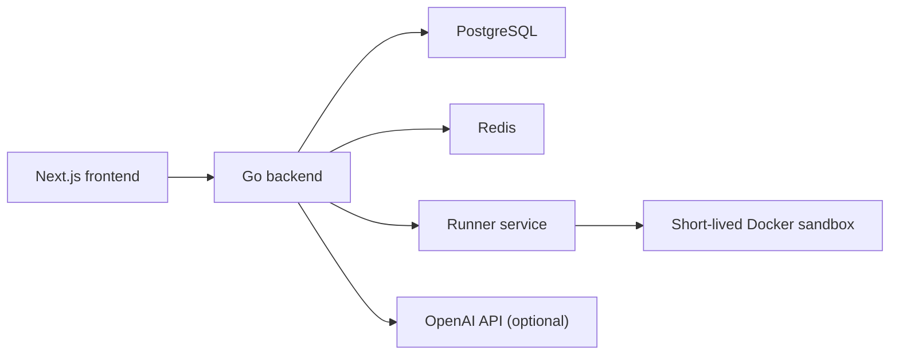

# Architecture

## Source of truth

SkillRoom uses a modular monolith backend plus a separate runner service. The supported production shape is:

- `backend`: Go API, auth, challenge lifecycle, scoring, room state, rankings, HR, AI integration
- `runner-service`: isolated Docker execution for React challenges
- `postgres`: durable store
- `redis`: cache, rate limits, hot operational state
- `frontend`: Next.js browser client

No alternate split-service topology is part of the supported MVP.

## Goals

- evaluate real React skill through runnable code
- keep correctness test-based and deterministic
- isolate untrusted execution from the API tier
- let recruiters trust score, confidence, and explanation data quickly

## Runtime diagram



## Backend modules

- `auth`: register, login, refresh, role checks
- `challenges`: template catalog, deterministic variants, session lifecycle
- `runner integration`: package workspace, send run request, collect raw execution results
- `evaluation`: score calculation from tests, lint, timing, and history
- `anti-cheat`: telemetry summaries, anomaly signals, similarity checks
- `skills`: skill updates, decay, confidence updates
- `room`: map skill state to visual items
- `rankings`: score/confidence/last-active ordering and percentile snapshots
- `hr`: candidate cards, search filters, companies, jobs, shortlists
- `ai`: optional hints, explanations, and mutation previews

## Execution flow

1. Backend creates a deterministic variant from `hash(user_id + template_id + attempt)`.
2. Candidate edits only allowed files.
3. Backend sends starter files, user files, and visible/hidden tests to the runner.
4. Runner creates an isolated Docker sandbox with no network and bounded CPU, memory, and timeout.
5. Runner executes the test suite and lint checks, then returns raw structured JSON.
6. Backend computes correctness, quality, speed, consistency, final score, skill updates, confidence, room state, and rankings.

## Scoring ownership

`internal/evaluation` is the only source of truth for shared score logic.

- runner responsibility: execute code and return raw results
- backend responsibility: calculate score, confidence, skill updates, room updates, and rankings

Formula:

```text
final_score =
  correctness * 0.4 +
  quality * 0.2 +
  speed * 0.2 +
  consistency * 0.2
```

## Room mapping

- `monitor -> react`
- `desk -> javascript`
- `chair -> architecture`
- `plant -> consistency`
- `trophy_case -> achievements / percentile`
- `shelf -> solved volume`

The `chair` rename is visual only. Architecture remains bound to the same slot semantics.

## Anti-cheat scope

SkillRoom does not auto-ban users in the MVP. It records signals and adjusts confidence:

- time to first input
- paste events
- focus loss events
- attempt count
- hidden test failures
- cross-user similarity within the same template

## Scale posture

The API tier is stateless aside from database/cache usage, so horizontal scale is straightforward:

- backend replicas scale on HTTP load
- runner replicas scale on execution throughput
- PostgreSQL remains the system of record
- Redis absorbs hot operational traffic

This is the intended MVP architecture and the repo is now aligned to it.
